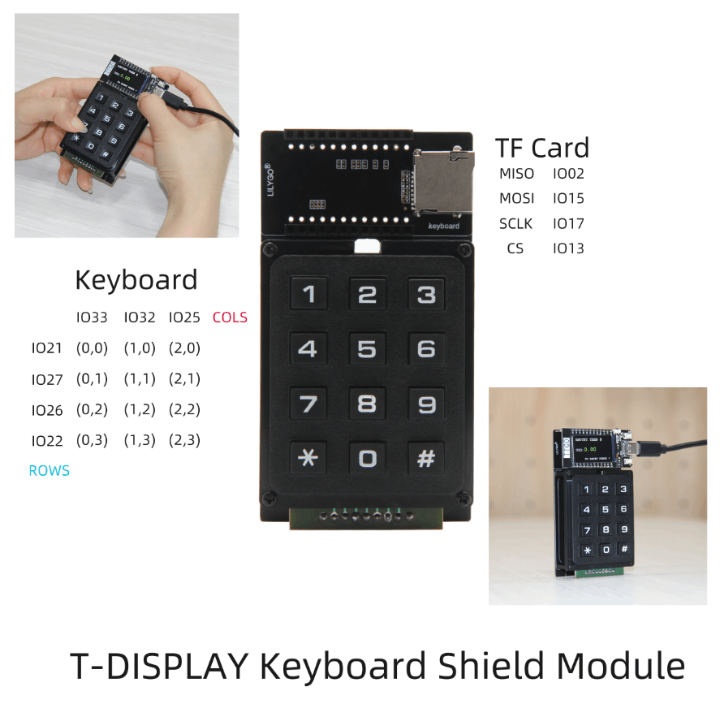

<h1 align = "center">🌟T-Display-Keyboard🌟</h1>

<h3 align = "left">Quick start:</h3>
1. Copy  **TFT_eSPI**  to the  **<C:\Users\Your User Name\Documents\Arduino\libraries>**  directory
2. Open **Arduino IDE,** find **TFT_eSPI** in the file and example, the **T-Display** factory test program is located at **TFT_eSPI -> FactoryTest**, you can also use other sample programs provided by TFT_eSPI
3 In the **Arduino IDE** tool options, select the development board  **ESP32 Dev Module**, **select Disable in the PSRAM option**, **select 4MB in the Flash Size option**, Other keep the default
4. Select the corresponding serial port. If you are not sure, please remove all the serial ports, leaving the board in the USB connection state, just select that one
5. Finally, click upload, the right arrow next to the tick

<h3 align = "left">Product 📷:</h3>

[Application](https://github.com/arcbtc/LNURLPoS)

<h3 align = "left">Application 📷:</h3>
In the example LUNRLPoS, refer to the [link](https://github.com/arcbtc/LNURLPoS) 

## Pinout

